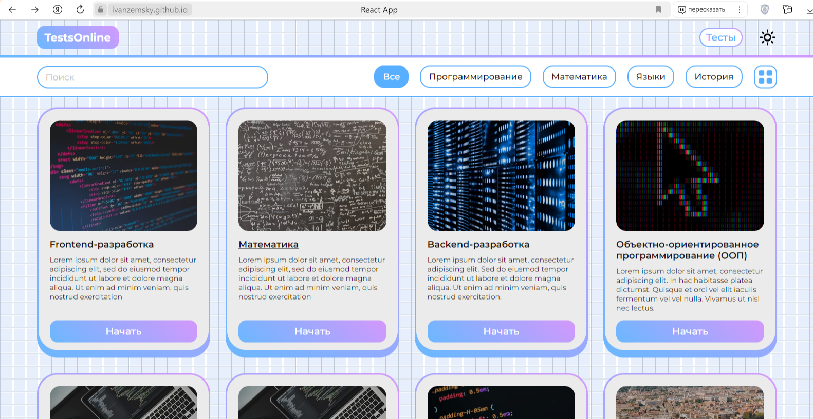

# TestsOnline - сайт для прохождения тестов по разным дисциплинам

На этом сайте пользователю предоставлена возможность пройти тесты по интересующим его дисциплинам.
Есть возможность сменить тему сайта, отфильтровать поиск по категориям, просмотреть результат: количество правильных ответов и все ответы.
При прохождении теста, результат сохраняется в локальное хранилище браузера. 

<picture>
 <source media="(prefers-color-scheme: dark)" srcset="./readme_img_dark.png">
 <source media="(prefers-color-scheme: light)" srcset="./readme_img_light.png">
 
</picture>

### Имеющиеся страницы: 
+ Приветствие
+ Тесты
+ Тест
+ Результат

### Стек технологий
Сайт написан с использованием React + Redux Toolkit.
Полный список используемых технологий:
+ React (JavaScript)
+ Redux Toolkit, RTK Query
+ redux-persist
+ CSS (CSS modules)